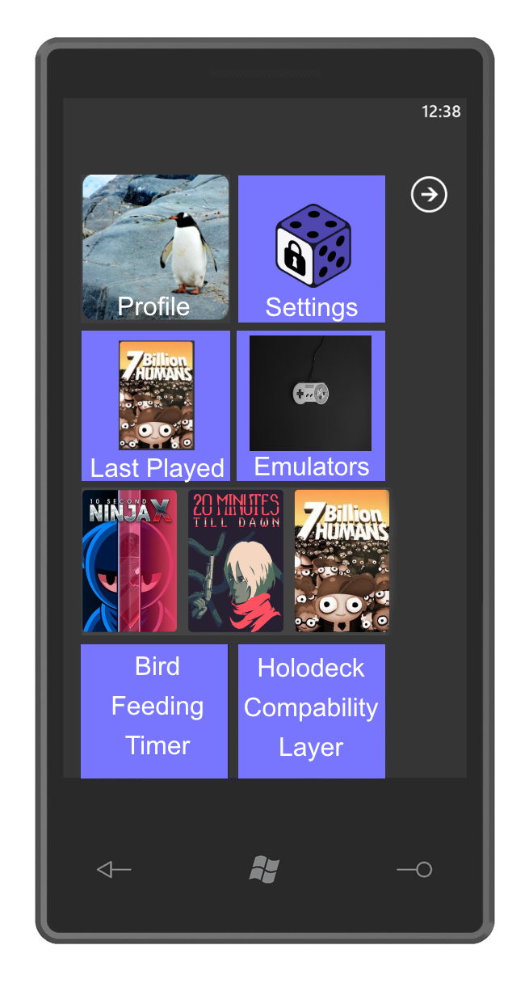

Hey Everyone!

The moment you've been waiting for is finally here. We've been working hard on it for months and are thrilled to announce that GameVault Client is **now available on Windows Phone 7**, powered by **Microsoft Silverlight**!

The Current PC-Version of GameVault will be discontinued and will no longer be available to download from the Microsoft Store, as the technology is too new and not well supported yet. We needed a battle-tested framework to ensure compatibility, so we decided to switch to Windows Phone 7 and Silverlight.

We understand the excitement and anticipation surrounding this release, and we're just as eager as you are to see how this integration will enhance your experience.

With GameVault on your Windows Phone 7 device, you can carry your favorite games with you wherever you go. Whether you're battling fierce foes, exploring vast virtual worlds, or simply passing the time with a quick puzzle game, GameVault ensures that the thrill of gaming is always at your fingertips.

Thanks to the seamless integration with Microsoft Silverlight, navigating through your gaming library has never been smoother or more intuitive. The Metro Live Tiles add a touch of elegance to the user interface, making it a joy to browse through your collection and discover new games.

And the best part? This is just the beginning. Our team is already hard at work on further enhancements and features, including the highly anticipated Holodeck edition of GameVault aswell as the new integrated "Bird Feeding Timer" feature, that automatically warns you when your pets are about to starve.

We're incredibly excited to embark on this journey with you and to continue pushing the boundaries of innovation. So what are you waiting for? Head over to the Windows Phone Store and download GameVault Client today to start your gaming adventure!

Happy gaming!
