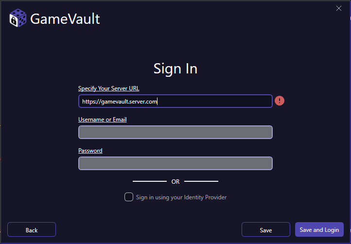
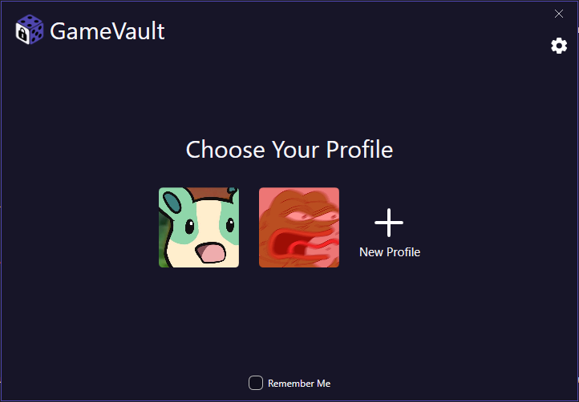
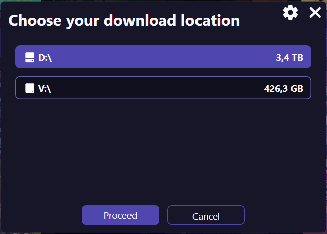

Long time no see!

It’s time to update GameVault, and we’re thrilled to announce a major new release: **The Identity Update**, and it’s a big one.

#### Why This Update Matters

Until now, GameVault relied on Basic Auth and supported only one user per device. This simple setup worked well when the platform was just a side project for two friends.

But GameVault has grown, with thousands of users, multiple configurations, and rising expectations. This update lays the groundwork for secure, scalable identity management and multi-user support. With this release, we’re introducing several key features:

#### 🔐 Modern Authentication & SSO Support

SSO support has been [one of the oldest and most requested features on our issue tracker](https://github.com/Phalcode/gamevault-backend/issues/6). Completely reworking the authentication system took over five months of development and testing. But now it’s done, a major milestone.

GameVault now uses OAuth 2.0 and OpenID Connect for authentication. This enables secure, modern login flows while keeping flexibility: traditional username and password logins still work but are now based on token authentication with session access and refresh tokens instead of basic auth.

Want to use an identity provider? GameVault integrates seamlessly with providers like Keycloak, Authentik, Authelia, Google, Microsoft, Discord, or virtually any RFC-compliant OAuth 2.0 or OIDC service.

This overhaul not only boosts security and user experience but also opens the door for future features like web-based clients.

#### 👥 Multi-Profile Support ([GameVault+](https://gamevau.lt/gamevault-plus))

Need multiple users or connections to different servers on the same machine? GameVault+ now offers fully separate user profiles, each with its own server connection, game library, save data, preferences, and more. Whether sharing a PC with family or housemates or just keeping things organized, profiles ensure everyone’s games and progress stay completely separate.

#### 💾 Installing Games Across Multiple Drives

Long overdue: GameVault now supports multiple root install directories, letting you decide where each game is installed. Whether you’re splitting your library across SSDs and HDDs or just organizing your collection, GameVault handles paths and indexing automatically.

#### Update Your Client and Server

Because of these major changes, older clients and servers are no longer compatible with the new infrastructure. Please update:

- **Client:** Update via [Microsoft Store](https://apps.microsoft.com/store/detail/gamevault/9PCKDV76GL75) or [GitHub](https://github.com/Phalcode/gamevault-app/releases)
- **Server:** Update via [Docker](https://hub.docker.com/r/phalcode/gamevault-backend) or [GitHub](https://github.com/Phalcode/gamevault-backend)

#### Thank You

Reaching this many users and GameVault+ subscribers is something we never imagined when we started. Thank you for trying, testing, using, and most of all, supporting GameVault.

We still love spending our free time on this project, and as long as you keep us going, we won’t stop.

Thank you, from the bottom of our hearts,
  
_The Phalcode Team_
